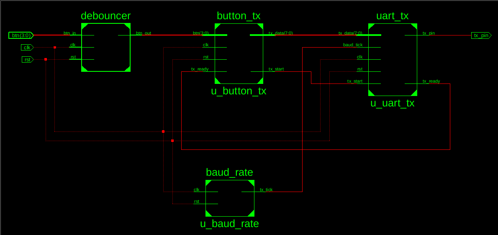
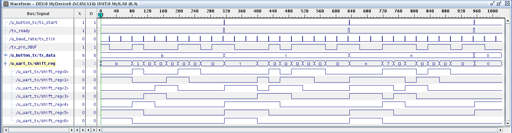
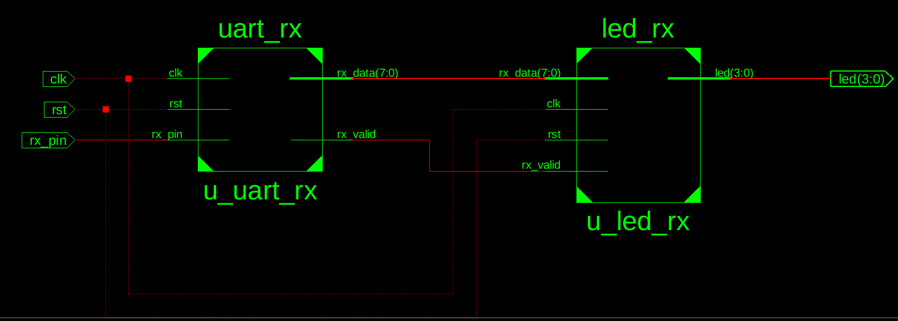
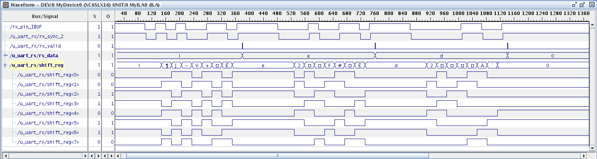

# SP601 Custom UART

## Overview
This repository contains a custom UART controller written in Verilog. The modules were designed completely from scratch. The project was synthesized, implemented, and hardware-verified on the **Xilinx Spartan-6 SP601 Evaluation Board**.

## SystemVerilog Conversion
This project is written in SystemVerilog. To ensure compatibility with standard Verilog synthesis tools, the source files were converted using the [sv2v](https://github.com/zachjs/sv2v) converter. The converted files are located in the **`sv2v_uart/`** directory.

## Repository Structure
* **`sv2v_uart/`** - SystemVerilog source files
* **`rtl/`** - core Verilog source files
* **`sim/`** - Testbenches used for simulation and verification
* **`fpga/`** - Top-level module (`top.v`) and hardware constraint files (`constraints.ucf`) specific to the SP601 board
* **`docs/`** - Screen shots from Xilinx ISE 14.7

## System Architecture
The system is logically divided into independent transmitting and receiving modules, each controlled by its own Finite State Machine

### Transmitter

### Receiver

### Hardware Interfaces
To interact with the UART modules physically, the project includes:
*   **`button_tx` & `debouncer`**: Allows sending specific data frames by pressing physical push-buttons on the board
*   **`led_rx`**: Decodes received UART frames and drives the onboard LEDs for visual feedback
